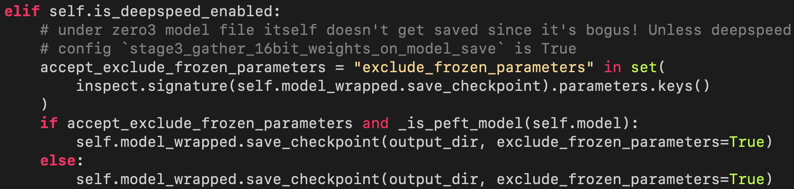
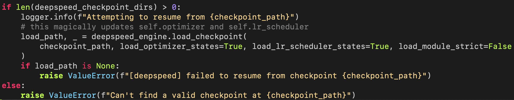

# Data

Multiple input files for each visual representation.

```
{how2sign,youtube-asl}/
    - annotation.{train,dev}.json
    - dino
        - dino.{train,dev}.{0,1,2,...}.h5
        - metadata_dino.{train,dev}.json
    - mae
        - dino.{train,dev}.{0,1,2,...}.h5
        - metadata_dino.{train,dev}.json
    - sign2vec
        - dino.{train,dev}.{0,1,2,...}.h5
        - metadata_dino.{train,dev}.json
    - pose
        - dino.{train,dev}.{0,1,2,...}.h5
        - metadata_dino.{train,dev}.json
```

`annotation.{train,dev}.json` (*`${clip_name}` is a string.*)
```
{
    ${video_id}: {
                "clip_order": [${clip_name}, ..., ],
                ${clip_name}: {
                                "translation": ....,
                                "paraphrases": [A, B, C, ...],
                                "keywords": [a, b, c, ...]},
                ${clip_name}: ....,
                },
    ${video_id}: ...
}
```
`dino/dino.train.${shard}.h5`
```
{
    ${video_id}: {
                    ${clip_name}: numpy.array (np.float16),
                    ${clip_name}: numpy.array, ...}
    ${video_id}:...
}
```
`dino/metadata_dino.train.json`
```
{
    ${video_id}: ${shard}, ${video_id}: ${shard}, ....
}
```

# !IMPORTANT! CHECK THIS BEFORE RUNNING TRAINING!
Find the location where the `transformers` package is installed in your `llava` environment. For example, for me, it is `/home/xzhan138/anaconda3/envs/llava/lib/python3.10/site-packages/transformers/`.

**Please make two modifications for proper checkpoint saving and loading:** 
1. In `${transformers_path}/trainer.py`, around line *2490*, add `exclude_frozen_parameters=True`.
    ```
    self.model_wrapper.save_checkpoint(output_dir, exclude_frozen_parameters=True)
    ```
    
    This enables saving only the parameters that are updated during training instead of all the parameters for each checkpoint. 
    During **pretraining**, we only need to save the `projector` weights, otherwise the checkpoint gets huge with the pretrained model.
2. In `${transformers_path}/integrations/deepspeed.py`, line *403*, add `load_module_strict=False`.
    ```
    local_path, _ = deepspeed_engine.load_checkpoint(
    checkpoint_path, load_optimizer_states=True, load_lr_scheduler_states=True, load_module_strict=False
    )
    ```
    
    This enables loading a model `state_dict` that contains only part of the parameters of the model. 
    During **pretraining**, when resuming training from a checkpoint, this allows to load only the `projector` weights.
3. In `${transformers_path}/trainer.py`, around line *2791*, in the `compute_loss` function, change `labels = inputs.pop("labels")` to `labels = inputs["labels"]` **and** add this line: `labels = torch.nn.functional.pad(labels,(outputs.logits.shape[1]-labels.shape[1], 0), 'constant', labels[0][0])` before `if model_name in MODEL_FOR_CAUSAL_LM_MAPPING_NAMES.values()`:
    ```
    def compute_loss(self, model, inputs, return_outputs=False):
        """
        How the loss is computed by Trainer. By default, all models return the loss in the first element.

        Subclass and override for custom behavior.
        """
        if self.label_smoother is not None and "labels" in inputs:
            ######Change this line######
            #labels = inputs.pop("labels")
            labels = inputs["labels"]
            ######Change this line######
        else:
            labels = None
        outputs = model(**inputs)
        ...
        ...
        ...
        ######Add this line########
        labels = torch.nn.functional.pad(labels,(outputs.logits.shape[1]-labels.shape[1], 0), 'constant', labels[0][0])
        ######Add this line########
        if model_name in MODEL_FOR_CAUSAL_LM_MAPPING_NAMES.values():
            loss = self.label_smoother(outputs, labels, shift_labels=True)
        else:
            loss = self.label_smoother(outputs, labels)
    ```
    If label smoothing is turned on with `label_smoothing_factor=0.1`, the original code would throw an error.
# Pretraining
1. Configuration file: 
```
signllava/configs/pretrain.yaml
```
2. Run pretraining:
```
bash signllava/scripts/pretrain.sh
```
**Pretraining** trains the `projectors` while keeping `Llama3` frozen. The following arguments in `pretrain.yaml` make it a **pretraining** procedure:
```
bits: 16
lora_enable: False
```
# Fine-tuning
1. Configuration file: 
```
signllava/configs/finetune.yaml
```
2. Run fine-tuning:
```
bash signllava/scripts/finetune.sh
```
**Fine-tuning** trains the `projectors` and fine-tunes `Llama3` with QLoRA at the same time. The following arguments in `finetune.yaml` make it a **fine-tuning** procedure:
```
bits: 4
lora_enable: True
pretrained_projector_ckpt: ${checkpoint_from_pretraining}/mp_rank_00_model_states.pt
```

# Run generation
```
bash signllava/scripts/generate.sh
```
1. Generate without context
```
SignDataArguments:
    prepared_predicted_context: False 
    on_the_fly_predicted_context: False
    context_window_size: 0
    prelude_window_size: 0
```
2. Generate with context
```
SignDataArguments:
    prepared_predicted_context: False 
    on_the_fly_predicted_context: False
    context_window_size: 2 # a number greater than 0
    prelude_window_size: 2 
```
3. Generate with predicted context
```
SignDataArguments:
    prepared_predicted_context: False 
    on_the_fly_predicted_context: True
    context_window_size: 2 # a number greater than 0
    prelude_window_size: 2 
```